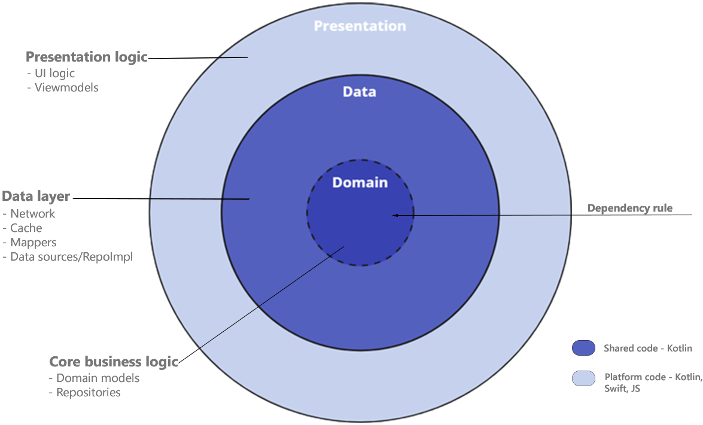

# TouristNewsCompose

### **Description**
Application connects to [appsloveworld](https://www.appsloveworld.com/free-online-sample-rest-api-url-for-testing) API to download its News feed & tourist profiles.

Data always comes from the local persistence (offline-first approach) and updates when necessary.

### **Built with modularization

### __Feature__

The `feature` package contains app feature code.

## Built with 🛠

- [Kotlin](https://kotlinlang.org/) - First class and official programming language for Android development.
- [Coroutines](https://kotlinlang.org/docs/reference/coroutines-overview.html) - For asynchronous and more..
- [Flow](https://kotlin.github.io/kotlinx.coroutines/kotlinx-coroutines-core/kotlinx.coroutines.flow/-flow/) - A cold asynchronous data stream that               sequentially emits values and completes normally or with an exception.
- [Android Architecture Components](https://developer.android.com/topic/libraries/architecture) - Collection of libraries that help you design robust,           testable, and maintainable apps.
- [ViewModel](https://developer.android.com/topic/libraries/architecture/viewmodel) - Stores UI-related data that isn't destroyed on UI changes.
 
- [Room](https://developer.android.com/topic/libraries/architecture/room) - SQLite object mapping library.
- [Navigation Component](https://developer.android.com/guide/navigation/navigation-getting-started) Navigation refers to the interactions that allow users to     navigate across, into, and back out from the different pieces of content within your app.
- [Dependency Injection](https://developer.android.com/training/dependency-injection) -
- [Hilt-Dagger](https://dagger.dev/hilt/) - Standard library to incorporate Dagger dependency injection into an Android application.
- [Hilt-ViewModel](https://developer.android.com/training/dependency-injection/hilt-jetpack) - DI for injecting `ViewModel`.
- [Retrofit](https://square.github.io/retrofit/) - A type-safe HTTP client for Android and Java.
- [Moshi](https://github.com/square/moshi) - A modern JSON library for Kotlin and Java.
- [Moshi Converter](https://github.com/square/retrofit/tree/master/retrofit-converters/moshi) - A Converter which uses Moshi for serialization to and from       JSON.
- [OkHttp](https://square.github.io/okhttp/) - A library developed by Square for sending and receive HTTP-based network requests
- [Material Components for Android](https://github.com/material-components/material-components-android) - Modular and customizable Material Design UI             components for Android.
- [Truth](https://truth.dev/) - Performing assertions in tests.
- [Turbine](https://cashapp.github.io/turbine/) - Testing library for kotlinx.coroutines Flow.
- [Mockk](https://mockk.io/) - Mocking library for Kotlin.
- [Coil](https://coil-kt.github.io/coil/) - An image loading library for Android backed by Kotlin Coroutines.

